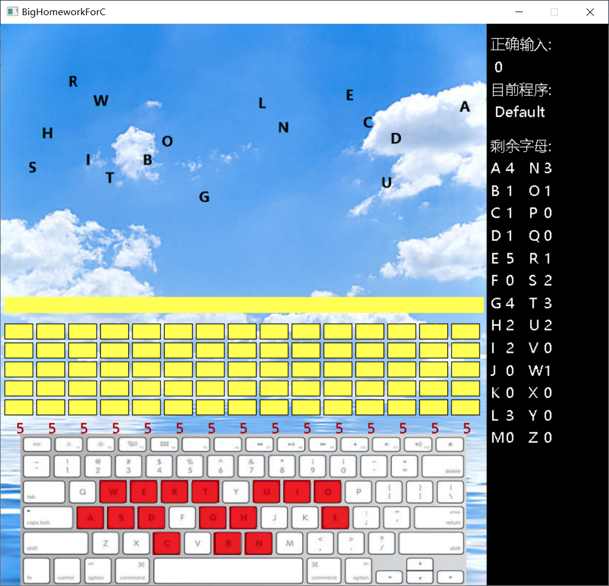

## 简介

本代码主要使用环境：Visual Studio 2015、EasyX、Windows 10

这是本人转专业后补修大一C程序设计课程时的代码，因当时代码风格并不成熟，自己对C的使用也不太熟练，对IDE的使用也是一塌糊涂，所以会看到很多离谱操作——如全部代码写在一个c文件里、大量复制粘贴、全局变量大量使用、代码前后风格迥异、资源文件乱放等。所以，这个大作业最多只是一个尝试，技术含量不高，随便看看就好。

## 作业要求：

## 系统设计

因为隔得时间比较久，只能找到当时的源文件，具体设计思路忘了，大概说一说各个界面的功能吧

开始界面，很普通，没有什么花里胡哨的，点Start Game开始游戏、点Exit退出

点开始游戏后，进入默认游戏界面，如课程要求所述，通过设定好的文字，字母从空中掉落，当一个字母砸中黄线时，随机选中一个砖块消失，当任一列砖墙数量为0时，则为失败；在任一列砖墙数量为0之前按对所有字母键，即为成功

屏幕下方可以看到提示——屏幕上有哪个字母就会提示按哪个键

右侧是信息栏，分别是当前已正确输入的字母个数、当前选中程序（字母是根据选择的程序生成的）、剩余字母个数。顺带一提，剩余字母大于1的，屏幕上也只会同时出现一个，如此时的A剩下4个，不会让屏幕上同时出现4个A，而是第一个A先落下，按对之后消失，之后第二个A才会出现

游戏进行界面

失败判定（失败后显示评分，播放失败bgm，5秒后返回开始界面）

在游戏界面，按下ESC，进入设置页面

上方分别是继续、重开、退出

单击Drop Speed后的加号和减号可以调整字母下落速度，最低1，最高15

>   单击Current
>   Program的A、B、C、D选项可以选择要练习的程序，分别是：字母表、HelloWorld程序、两个整数相加、默认程序，每个程序要输入的字母数量不同

所有字母输入正确显示评分，播放成功bgm，五秒后返回开始界面

评分机制具体怎么设置的忘了，大概是综合当前程序难度、下落速度、剩余砖块数量等给出一个总评

以上就是大致内容，总体设计的比较简陋，设计思路也比较简单，算是本人转入软件工程专业后第一次代码行数\>2000的一次尝试（虽然大部分是重复代码和复制粘贴），就当做是一次练习吧
